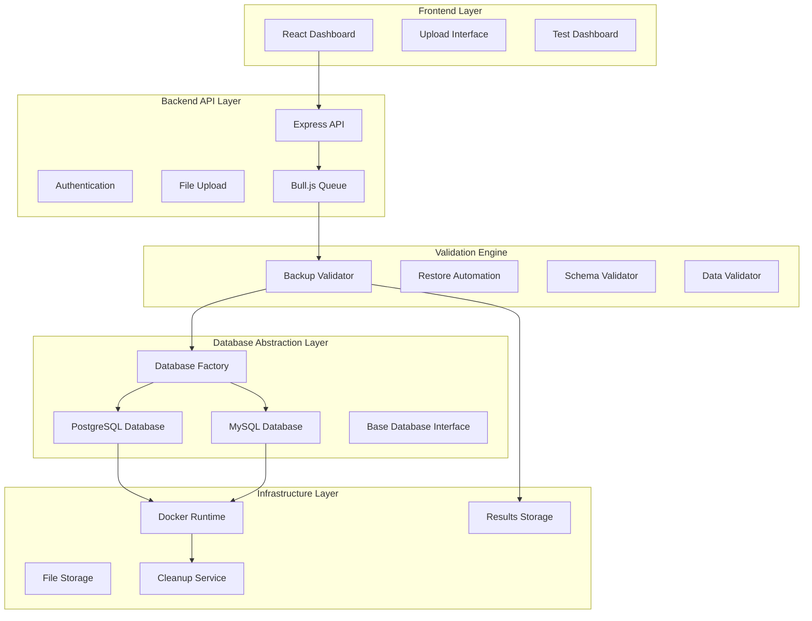
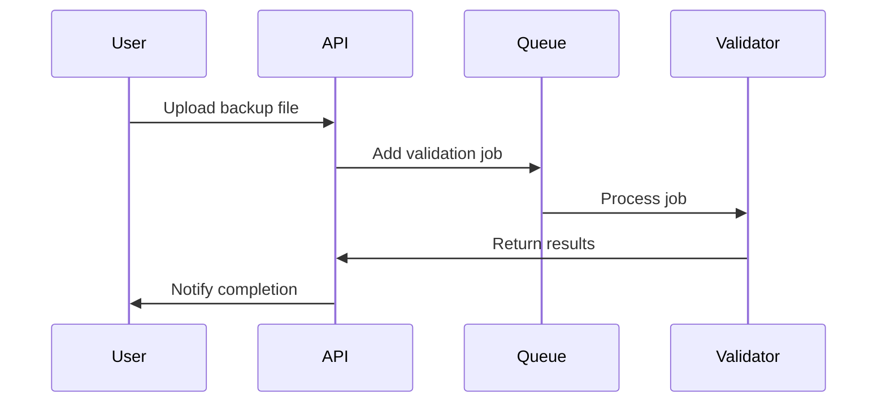
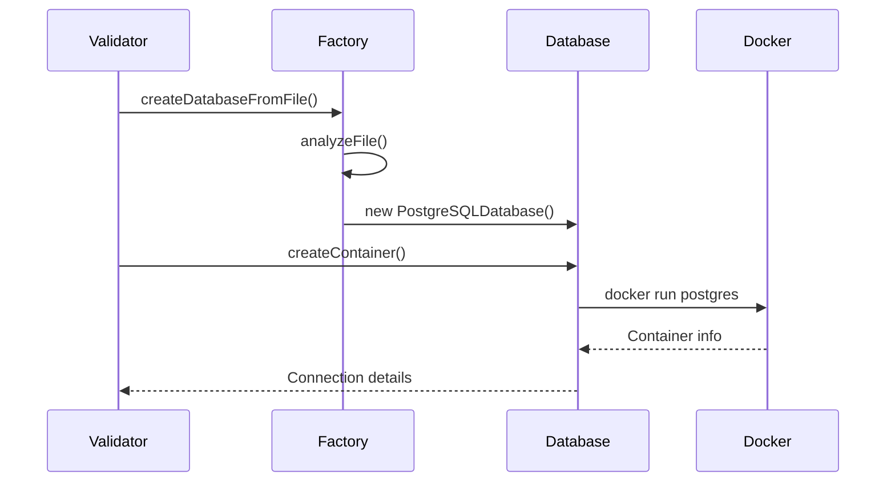
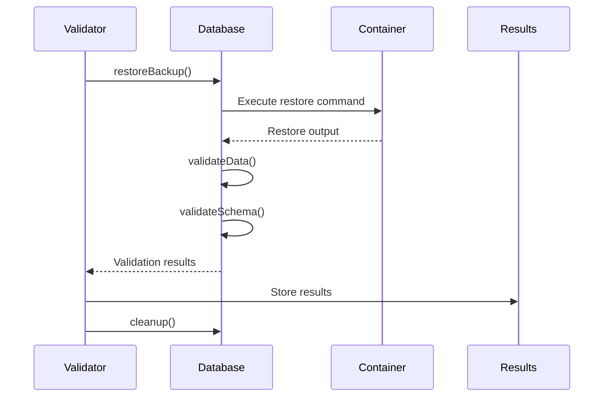
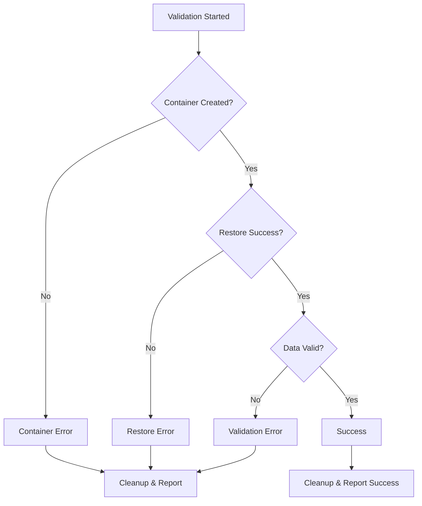

# BackupGuardian Architecture Documentation

## System Overview

BackupGuardian is a multi-layer backup validation system designed to automatically test database backups in isolated environments. The architecture emphasizes modularity, testability, and multi-database support through abstraction layers.

## Core Architecture



## Database Abstraction Layer

### Design Pattern
The database abstraction layer implements the **Factory Pattern** with **Abstract Base Classes** to enable support for multiple database types while maintaining a consistent interface.

### Key Components

#### 1. Base Database Interface (`BaseDatabase`)
Defines the contract that all database implementations must follow:

```javascript
class BaseDatabase {
    // Container Management
    async createContainer(testId) { throw new Error('Must implement'); }
    async waitForContainer(containerName, maxAttempts) { throw new Error('Must implement'); }
    async cleanup(containerName) { throw new Error('Must implement'); }
    
    // Backup Operations  
    async restoreBackup(backupFilePath, connectionInfo, containerName) { throw new Error('Must implement'); }
    async validateData(connectionInfo, containerName, options) { throw new Error('Must implement'); }
    async validateSchema(connectionInfo, containerName, originalSchema) { throw new Error('Must implement'); }
    
    // Information Methods
    getConnectionInfo(testId) { throw new Error('Must implement'); }
    getDatabaseType() { throw new Error('Must implement'); }
    getSupportedExtensions() { throw new Error('Must implement'); }
}
```

#### 2. Database Factory (`DatabaseFactory`)
Central factory for creating database instances with intelligent auto-detection:

```javascript
const factory = new DatabaseFactory();

// Explicit type creation
const pgDb = factory.createDatabase('postgresql');

// Auto-detection from file
const autoDb = factory.createDatabaseFromFile('/path/to/backup.sql');

// Auto-detection with options
const smartDb = factory.createDatabaseAuto({
    filePath: '/path/to/backup.sql',
    config: { basePort: 5500 }
});
```

#### 3. Database Implementations

**PostgreSQL Database** (`PostgreSQLDatabase`):
- Supports: `.sql`, `.dump`, `.backup` files
- Container: `postgres:15-alpine`
- Tools: `psql`, `pg_restore`, `pg_isready`
- Port allocation: Starting from 5433

**MySQL Database** (`MySQLDatabase`):
- Supports: `.sql`, `.mysqldump` files  
- Container: `mysql:8.0`
- Tools: `mysql`, `mysqldump`, `mysqladmin`
- Port allocation: Starting from 3307

### Auto-Detection Algorithm

The factory uses a multi-stage detection process:

1. **Filename Analysis**: Checks for database-specific keywords (`postgres`, `mysql`, etc.)
2. **Extension Mapping**: Maps file extensions to likely database types
3. **Content Analysis**: Analyzes file headers for database-specific syntax
4. **Scoring System**: Counts database-specific indicators and selects highest score

```javascript
// Example content analysis indicators
const pgIndicators = ['pg_dump', 'plpgsql', 'serial primary key', 'nextval('];
const mysqlIndicators = ['mysqldump', 'auto_increment', 'engine=', 'charset='];
```

## Testing Framework Architecture

### Jest Integration
BackupGuardian uses **Jest** as the primary testing framework with comprehensive coverage:

```javascript
// Jest Configuration (jest.config.js)
module.exports = {
    testEnvironment: 'node',
    roots: ['<rootDir>/src'],
    testMatch: ['**/__tests__/**/*.js', '**/?(*.)+(spec|test).js'],
    collectCoverageFrom: ['src/**/*.js'],
    testTimeout: 30000,
    setupFilesAfterEnv: ['<rootDir>/src/__tests__/setup.js']
};
```

### Test Categories

#### 1. Unit Tests (`*.test.js`)
- **Database Abstraction**: Factory pattern, configuration management
- **Service Logic**: Validation algorithms, data processing
- **Utilities**: Helper functions, configuration parsing

#### 2. Integration Tests (Root-level `test-*.js`)
- **API Endpoints**: Authentication, file upload, result retrieval
- **Docker Integration**: Container lifecycle, restore automation
- **Database Operations**: Full backup validation workflow
- **Queue Processing**: Background job execution

#### 3. Coverage Testing
```bash
npm run test:coverage  # Generates HTML coverage reports
npm run test:watch     # Watch mode for development
npm test              # Run all tests (unit + integration)
```

### Test Structure Example

```javascript
// src/services/backup-validator.test.js
describe('BackupValidator', () => {
    let validator;
    let mockDatabase;
    
    beforeEach(() => {
        mockDatabase = {
            createContainer: jest.fn(),
            restoreBackup: jest.fn(),
            validateData: jest.fn(),
            cleanup: jest.fn()
        };
        validator = new BackupValidator(mockDatabase);
    });
    
    describe('validateBackup', () => {
        it('should successfully validate a PostgreSQL backup', async () => {
            // Test implementation
        });
    });
});
```

## Validation Engine Flow

### 1. Upload & Queue Processing


### 2. Database Detection & Container Creation


### 3. Backup Validation Process


## Data Flow Architecture

### File Processing Pipeline
1. **Upload** → File received and temporarily stored
2. **Detection** → Database type auto-detected from file
3. **Queue** → Validation job added to background queue
4. **Container** → Isolated database container created
5. **Restore** → Backup restored to test container
6. **Validate** → Schema and data integrity checked
7. **Results** → Success/failure stored with details
8. **Cleanup** → Test container removed
9. **Notify** → User notified of results

### Error Handling Flow


## Configuration Management

### Environment-Based Configuration
```javascript
// Database-specific environment variables
POSTGRES_TEST_IMAGE=postgres:15-alpine
POSTGRES_TEST_USER=testuser
POSTGRES_TEST_PASSWORD=[REDACTED:password]
POSTGRES_TEST_BASE_PORT=5433

MYSQL_TEST_IMAGE=mysql:8.0
MYSQL_TEST_USER=testuser
MYSQL_TEST_ROOT_PASSWORD=[REDACTED:password]
MYSQL_TEST_BASE_PORT=3307
```

### Configuration Hierarchy
1. **Environment Variables** (highest priority)
2. **Configuration Files** (`.env`, config objects)
3. **Default Values** (fallback defaults)

## Security Architecture

### Isolation Principles
- **Container Isolation**: Each test runs in a separate Docker container
- **Network Isolation**: Containers use random ports with no external access
- **Data Isolation**: No persistent storage, containers auto-delete
- **File Isolation**: Temporary files cleaned up after validation

### Security Controls
- **File Size Limits**: Maximum upload size (100MB default)
- **File Type Validation**: Only database backup files accepted
- **Container Timeouts**: Automatic cleanup after timeout
- **User Authentication**: JWT-based API authentication
- **Audit Logging**: All validation attempts logged

## Performance Considerations

### Scalability Design
- **Horizontal Scaling**: Queue-based processing allows multiple workers
- **Resource Management**: Container limits prevent resource exhaustion
- **Port Management**: Dynamic port allocation prevents conflicts
- **Cleanup Automation**: Prevents resource leaks

### Performance Metrics
- **Container Startup**: ~2-5 seconds for PostgreSQL
- **Small Backup Restore**: <30 seconds for files <10MB
- **Concurrent Tests**: Up to 10 parallel validations
- **Memory Usage**: ~256MB per test container

## Future Architecture Enhancements

### Planned Expansions
1. **Additional Database Types**: SQLite, MongoDB, Redis support
2. **Cloud Database Testing**: Direct connection testing without files
3. **Distributed Processing**: Multi-node validation clusters
4. **Advanced Analytics**: Backup health trends and reporting
5. **CI/CD Integration**: GitHub Actions, Jenkins plugins

### Migration Considerations
- **Backward Compatibility**: Legacy wrapper classes maintain old interfaces
- **Gradual Migration**: New features use abstraction layer
- **Configuration Migration**: Automated config updates
- **Data Migration**: Results schema upgrades with versioning

This architecture provides a solid foundation for reliable backup validation while maintaining flexibility for future enhancements and database type additions.
