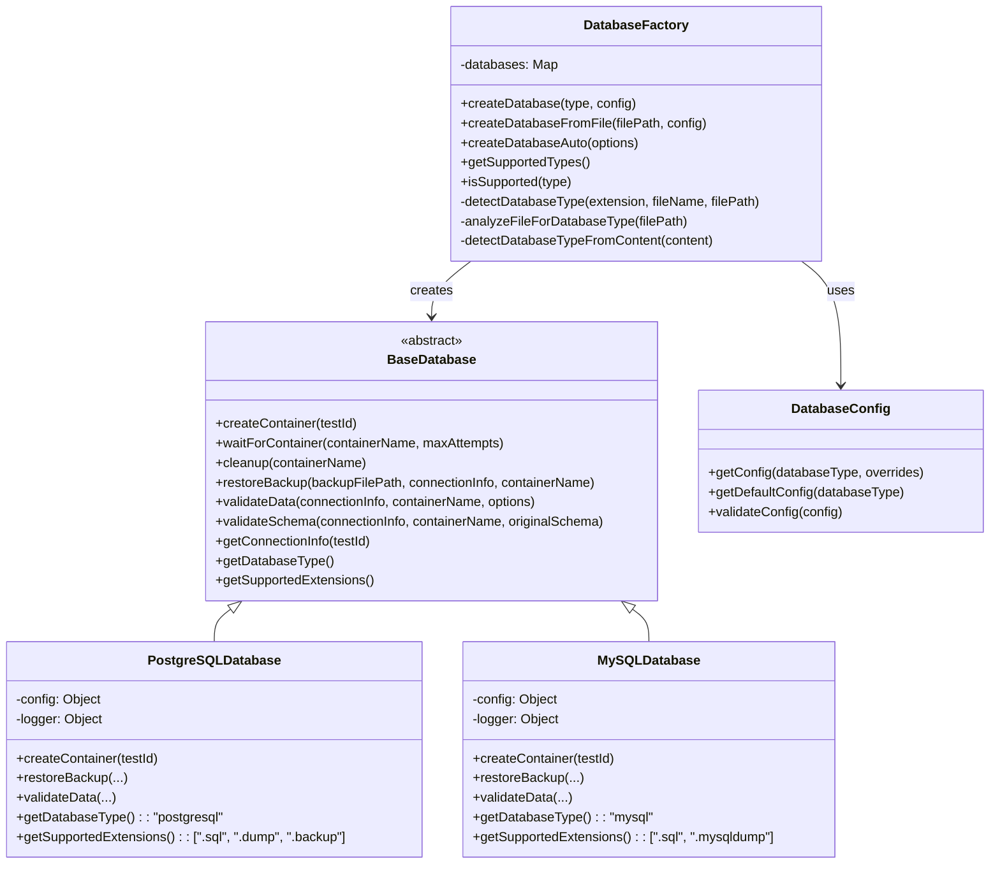

# Database Abstraction Layer Guide

## Overview

The Database Abstraction Layer provides a unified interface for validating backups across different database types. It uses the Factory Pattern with Abstract Base Classes to enable seamless support for PostgreSQL, MySQL, and future database systems.

## Architecture Diagram



## Core Components

### 1. BaseDatabase (Abstract Class)

The abstract base class defines the contract that all database implementations must follow:

```javascript
// src/database/base-database.js
class BaseDatabase {
    constructor(config = {}) {
        this.config = config;
        this.logger = config.logger || console;
    }
    
    // Abstract methods that must be implemented
    async createContainer(testId) {
        throw new Error('createContainer must be implemented by subclass');
    }
    
    async waitForContainer(containerName, maxAttempts = 30) {
        throw new Error('waitForContainer must be implemented by subclass');
    }
    
    async cleanup(containerName) {
        throw new Error('cleanup must be implemented by subclass');
    }
    
    async restoreBackup(backupFilePath, connectionInfo, containerName) {
        throw new Error('restoreBackup must be implemented by subclass');
    }
    
    async validateData(connectionInfo, containerName, options = {}) {
        throw new Error('validateData must be implemented by subclass');
    }
    
    async validateSchema(connectionInfo, containerName, originalSchema = null) {
        throw new Error('validateSchema must be implemented by subclass');
    }
    
    getConnectionInfo(testId) {
        throw new Error('getConnectionInfo must be implemented by subclass');
    }
    
    getDatabaseType() {
        throw new Error('getDatabaseType must be implemented by subclass');
    }
    
    getSupportedExtensions() {
        throw new Error('getSupportedExtensions must be implemented by subclass');
    }
}
```

### 2. DatabaseFactory (Factory Pattern)

The factory handles database creation with intelligent auto-detection:

```javascript
// Usage Examples
const { DatabaseFactory } = require('./src/database');

const factory = new DatabaseFactory();

// 1. Explicit type creation
const postgresDb = factory.createDatabase('postgresql', {
    basePort: 5500,
    password: 'custom-password'
});

// 2. Auto-detection from filename
const autoDb = factory.createDatabaseFromFile('/path/to/backup-postgres.sql');

// 3. Auto-detection with multiple options
const smartDb = factory.createDatabaseAuto({
    filePath: '/path/to/backup.sql',
    type: 'postgresql', // Optional override
    config: { basePort: 5433 }
});

// 4. Content-based detection
const contentDb = factory.createDatabaseAuto({
    fileContent: 'CREATE DATABASE test; SELECT pg_database_size("test");'
});
```

### 3. Auto-Detection Algorithm

The factory uses a sophisticated multi-stage detection process:

#### Stage 1: Filename Analysis
```javascript
detectDatabaseType(fileExtension, fileName, filePath) {
    // Check for obvious indicators in filename
    if (fileName.includes('postgres') || fileName.includes('pg_')) {
        return 'postgresql';
    }
    
    if (fileName.includes('mysql') || fileName.includes('mariadb')) {
        return 'mysql';
    }
    
    // Check file extension patterns
    switch (fileExtension) {
        case '.sql':
            return this.analyzeFileForDatabaseType(filePath);
        case '.dump':
        case '.backup':
            return 'postgresql'; // PostgreSQL-specific formats
        case '.mysqldump':
            return 'mysql';
        default:
            return 'postgresql'; // Default fallback
    }
}
```

#### Stage 2: Content Analysis
```javascript
detectDatabaseTypeFromContent(content) {
    const contentLower = content.toLowerCase();
    
    // PostgreSQL indicators
    const pgIndicators = [
        'pg_dump', 'plpgsql', 'serial primary key',
        'nextval(', 'pg_catalog', 'information_schema'
    ];
    
    // MySQL indicators  
    const mysqlIndicators = [
        'mysqldump', 'auto_increment', 'engine=',
        'charset=', 'collate=', 'use `'
    ];
    
    let pgScore = 0;
    let mysqlScore = 0;
    
    // Count indicators and return highest scoring type
    for (const indicator of pgIndicators) {
        if (contentLower.includes(indicator)) pgScore++;
    }
    
    for (const indicator of mysqlIndicators) {
        if (contentLower.includes(indicator)) mysqlScore++;
    }
    
    return mysqlScore > pgScore ? 'mysql' : 'postgresql';
}
```

## Database Implementations

### PostgreSQL Implementation

```javascript
// src/database/postgresql-database.js
class PostgreSQLDatabase extends BaseDatabase {
    constructor(config = {}) {
        super(config);
        this.dbConfig = new DatabaseConfig().getConfig('postgresql', config);
    }
    
    async createContainer(testId) {
        const containerName = `bg-test-${testId}`;
        const port = await this.findAvailablePort();
        
        const dockerCommand = `docker run -d --name ${containerName} ` +
            `-e POSTGRES_USER=${this.dbConfig.user} ` +
            `-e POSTGRES_PASSWORD=${this.dbConfig.password} ` +
            `-e POSTGRES_DB=${this.dbConfig.database} ` +
            `-p ${port}:5432 ` +
            `${this.dbConfig.image}`;
            
        const containerId = await this.executeCommand(dockerCommand);
        await this.waitForContainer(containerName);
        
        return {
            containerName,
            containerId: containerId.trim(),
            connectionInfo: {
                host: 'localhost',
                port,
                user: this.dbConfig.user,
                password: this.dbConfig.password,
                database: this.dbConfig.database
            }
        };
    }
    
    async restoreBackup(backupFilePath, connectionInfo, containerName) {
        const { host, port, user, password, database } = connectionInfo;
        
        // Determine restore command based on file type
        let restoreCommand;
        const fileExtension = path.extname(backupFilePath).toLowerCase();
        
        if (fileExtension === '.sql') {
            restoreCommand = `PGPASSWORD=${password} psql -h ${host} -p ${port} -U ${user} -d ${database} -f ${backupFilePath}`;
        } else {
            restoreCommand = `PGPASSWORD=${password} pg_restore -h ${host} -p ${port} -U ${user} -d ${database} ${backupFilePath}`;
        }
        
        const result = await this.executeCommand(restoreCommand);
        
        return {
            success: !result.stderr || result.stderr.length === 0,
            output: result.stdout,
            errors: result.stderr,
            command: restoreCommand.replace(password, '***')
        };
    }
    
    async validateData(connectionInfo, containerName, options = {}) {
        const client = new Client(connectionInfo);
        await client.connect();
        
        try {
            // Get table count
            const tableCountResult = await client.query(`
                SELECT COUNT(*) as table_count 
                FROM information_schema.tables 
                WHERE table_schema = 'public'
            `);
            
            // Get total row count across all tables
            const rowCountResult = await client.query(`
                SELECT 
                    schemaname,
                    tablename,
                    n_tup_ins - n_tup_del as row_count
                FROM pg_stat_user_tables
            `);
            
            return {
                isValid: true,
                tableCount: parseInt(tableCountResult.rows[0].table_count),
                totalRows: rowCountResult.rows.reduce((sum, row) => sum + parseInt(row.row_count || 0), 0),
                tables: rowCountResult.rows
            };
        } finally {
            await client.end();
        }
    }
    
    getDatabaseType() {
        return 'postgresql';
    }
    
    getSupportedExtensions() {
        return ['.sql', '.dump', '.backup'];
    }
}
```

### MySQL Implementation Structure

```javascript
// src/database/mysql-database.js  
class MySQLDatabase extends BaseDatabase {
    constructor(config = {}) {
        super(config);
        this.dbConfig = new DatabaseConfig().getConfig('mysql', config);
    }
    
    async createContainer(testId) {
        const containerName = `bg-test-${testId}`;
        const port = await this.findAvailablePort();
        
        const dockerCommand = `docker run -d --name ${containerName} ` +
            `-e MYSQL_ROOT_PASSWORD=${this.dbConfig.rootPassword} ` +
            `-e MYSQL_USER=${this.dbConfig.user} ` +
            `-e MYSQL_PASSWORD=${this.dbConfig.password} ` +
            `-e MYSQL_DATABASE=${this.dbConfig.database} ` +
            `-p ${port}:3306 ` +
            `${this.dbConfig.image}`;
            
        const containerId = await this.executeCommand(dockerCommand);
        await this.waitForContainer(containerName);
        
        return {
            containerName,
            containerId: containerId.trim(),
            connectionInfo: {
                host: 'localhost',
                port,
                user: this.dbConfig.user,
                password: this.dbConfig.password,
                database: this.dbConfig.database
            }
        };
    }
    
    async restoreBackup(backupFilePath, connectionInfo, containerName) {
        const { host, port, user, password, database } = connectionInfo;
        
        const restoreCommand = `mysql -h ${host} -P ${port} -u ${user} -p${password} ${database} < ${backupFilePath}`;
        
        const result = await this.executeCommand(restoreCommand);
        
        return {
            success: !result.stderr || result.stderr.length === 0,
            output: result.stdout,
            errors: result.stderr,
            command: restoreCommand.replace(password, '***')
        };
    }
    
    async validateData(connectionInfo, containerName, options = {}) {
        const connection = await mysql.createConnection(connectionInfo);
        
        try {
            // Get table count
            const [tableCountRows] = await connection.execute(`
                SELECT COUNT(*) as table_count 
                FROM information_schema.tables 
                WHERE table_schema = ?
            `, [connectionInfo.database]);
            
            // Get row counts for each table
            const [tableRows] = await connection.execute(`
                SELECT 
                    table_name,
                    table_rows 
                FROM information_schema.tables 
                WHERE table_schema = ?
            `, [connectionInfo.database]);
            
            return {
                isValid: true,
                tableCount: tableCountRows[0].table_count,
                totalRows: tableRows.reduce((sum, row) => sum + parseInt(row.table_rows || 0), 0),
                tables: tableRows
            };
        } finally {
            await connection.end();
        }
    }
    
    getDatabaseType() {
        return 'mysql';
    }
    
    getSupportedExtensions() {
        return ['.sql', '.mysqldump'];
    }
}
```

## Configuration Management

### Database Configuration Class

```javascript
// src/database/database-config.js
class DatabaseConfig {
    getConfig(databaseType, overrides = {}) {
        const defaultConfig = this.getDefaultConfig(databaseType);
        const envConfig = this.getEnvironmentConfig(databaseType);
        
        return {
            ...defaultConfig,
            ...envConfig,
            ...overrides
        };
    }
    
    getDefaultConfig(databaseType) {
        const configs = {
            postgresql: {
                image: 'postgres:15-alpine',
                port: 5432,
                user: 'testuser',
                database: 'testdb',
                password: 'testpass123',
                basePort: 5433
            },
            mysql: {
                image: 'mysql:8.0',
                port: 3306,
                user: 'testuser',
                database: 'testdb',
                password: 'testpass123',
                rootPassword: 'rootpass123',
                basePort: 3307
            }
        };
        
        return configs[databaseType] || {};
    }
    
    getEnvironmentConfig(databaseType) {
        if (databaseType === 'postgresql') {
            return {
                image: process.env.POSTGRES_TEST_IMAGE,
                user: process.env.POSTGRES_TEST_USER,
                password: process.env.POSTGRES_TEST_PASSWORD,
                basePort: parseInt(process.env.POSTGRES_TEST_BASE_PORT) || undefined
            };
        }
        
        if (databaseType === 'mysql') {
            return {
                image: process.env.MYSQL_TEST_IMAGE,
                user: process.env.MYSQL_TEST_USER,
                password: process.env.MYSQL_TEST_PASSWORD,
                rootPassword: process.env.MYSQL_TEST_ROOT_PASSWORD,
                basePort: parseInt(process.env.MYSQL_TEST_BASE_PORT) || undefined
            };
        }
        
        return {};
    }
}
```

### Environment Configuration

```bash
# .env file example
# PostgreSQL Configuration
POSTGRES_TEST_IMAGE=postgres:15-alpine
POSTGRES_TEST_USER=testuser
POSTGRES_TEST_PASSWORD=secure-test-password
POSTGRES_TEST_BASE_PORT=5433

# MySQL Configuration  
MYSQL_TEST_IMAGE=mysql:8.0
MYSQL_TEST_USER=testuser
MYSQL_TEST_PASSWORD=secure-test-password
MYSQL_TEST_ROOT_PASSWORD=secure-root-password
MYSQL_TEST_BASE_PORT=3307

# General Configuration
DOCKER_TIMEOUT=30000
MAX_CONCURRENT_TESTS=5
```

## Usage Examples

### Basic Usage

```javascript
const { DatabaseFactory } = require('./src/database');

async function validateBackup() {
    const factory = new DatabaseFactory();
    
    // Create database instance (auto-detected from file)
    const database = factory.createDatabaseFromFile('./backups/prod-backup.sql');
    
    // Create test container
    const container = await database.createContainer('validation-123');
    
    try {
        // Restore backup
        const restoreResult = await database.restoreBackup(
            './backups/prod-backup.sql',
            container.connectionInfo,
            container.containerName
        );
        
        if (!restoreResult.success) {
            throw new Error(`Restore failed: ${restoreResult.errors}`);
        }
        
        // Validate data integrity
        const dataValidation = await database.validateData(
            container.connectionInfo,
            container.containerName
        );
        
        console.log('Validation Results:', {
            restore: restoreResult.success,
            tableCount: dataValidation.tableCount,
            totalRows: dataValidation.totalRows
        });
        
    } finally {
        // Always cleanup
        await database.cleanup(container.containerName);
    }
}
```

### Advanced Configuration

```javascript
const factory = new DatabaseFactory();

// Custom PostgreSQL configuration
const database = factory.createDatabase('postgresql', {
    basePort: 5500,
    password: 'custom-password',
    image: 'postgres:13',
    logger: customLogger
});

// MySQL with specific configuration
const mysqlDb = factory.createDatabase('mysql', {
    basePort: 3400,
    rootPassword: 'secure-root-pass',
    image: 'mysql:8.0.33'
});
```

### Integration with BackupValidator

```javascript
// Updated BackupValidator to use database abstraction
class BackupValidator {
    constructor(database = null, logger = console) {
        this.database = database;
        this.factory = new DatabaseFactory();
        this.logger = logger;
    }
    
    async validateBackup(backupFilePath, options = {}) {
        // Create database instance if not provided
        if (!this.database) {
            this.database = this.factory.createDatabaseFromFile(backupFilePath, options.config);
        }
        
        const testId = `test-${Date.now()}-${Math.random().toString(36).substr(2, 9)}`;
        
        try {
            // Create container
            const container = await this.database.createContainer(testId);
            
            // Restore backup
            const restoreResult = await this.database.restoreBackup(
                backupFilePath,
                container.connectionInfo,
                container.containerName
            );
            
            // Validate data
            const dataValidation = await this.database.validateData(
                container.connectionInfo,
                container.containerName,
                options.validation
            );
            
            return {
                success: restoreResult.success && dataValidation.isValid,
                databaseType: this.database.getDatabaseType(),
                containerName: container.containerName,
                restore: restoreResult,
                validation: dataValidation,
                testId
            };
            
        } finally {
            await this.database.cleanup(`bg-test-${testId}`);
        }
    }
}
```

## Testing the Abstraction Layer

### Unit Tests

```javascript
// test-database-abstraction.js
describe('Database Abstraction Layer', () => {
    let factory;
    
    beforeEach(() => {
        factory = new DatabaseFactory();
    });
    
    it('should create correct database type', () => {
        const pgDb = factory.createDatabase('postgresql');
        const mysqlDb = factory.createDatabase('mysql');
        
        expect(pgDb.getDatabaseType()).toBe('postgresql');
        expect(mysqlDb.getDatabaseType()).toBe('mysql');
    });
    
    it('should auto-detect from filename', () => {
        const tests = [
            { file: 'backup-postgres.sql', expected: 'postgresql' },
            { file: 'backup-mysql.sql', expected: 'mysql' },
            { file: 'pg_dump_backup.sql', expected: 'postgresql' },
            { file: 'mysqldump_backup.sql', expected: 'mysql' }
        ];
        
        tests.forEach(({ file, expected }) => {
            const db = factory.createDatabaseFromFile(file);
            expect(db.getDatabaseType()).toBe(expected);
        });
    });
    
    it('should detect from content analysis', () => {
        const pgContent = 'CREATE DATABASE test; SELECT pg_database_size(\'test\');';
        const mysqlContent = 'CREATE DATABASE test; ALTER TABLE test ENGINE=InnoDB;';
        
        const pgDb = factory.createDatabaseAuto({ fileContent: pgContent });
        const mysqlDb = factory.createDatabaseAuto({ fileContent: mysqlContent });
        
        expect(pgDb.getDatabaseType()).toBe('postgresql');
        expect(mysqlDb.getDatabaseType()).toBe('mysql');
    });
});
```

### Integration Tests

```javascript
// test-backup-validation-integration.js
describe('Backup Validation Integration', () => {
    it('should validate PostgreSQL backup end-to-end', async () => {
        const factory = new DatabaseFactory();
        const database = factory.createDatabase('postgresql');
        const validator = new BackupValidator(database);
        
        const result = await validator.validateBackup('./test-backups/sample-postgres.sql');
        
        expect(result.success).toBe(true);
        expect(result.databaseType).toBe('postgresql');
        expect(result.validation.tableCount).toBeGreaterThan(0);
    }, 60000);
});
```

## Migration from Legacy Code

### Legacy Compatibility

The abstraction layer maintains backward compatibility through legacy wrapper classes:

```javascript
// src/services/docker-runner-legacy.js
class DockerRunnerLegacy {
    constructor() {
        this.factory = new DatabaseFactory();
        this.database = this.factory.createDatabase('postgresql');
    }
    
    async createContainer(testId) {
        return await this.database.createContainer(testId);
    }
    
    async cleanup(containerName) {
        return await this.database.cleanup(containerName);
    }
}

// src/services/restore-automation-legacy.js  
class RestoreAutomationLegacy {
    constructor() {
        this.factory = new DatabaseFactory();
        this.database = this.factory.createDatabase('postgresql');
    }
    
    async executeRestore(backupPath, connectionInfo, containerName) {
        return await this.database.restoreBackup(backupPath, connectionInfo, containerName);
    }
}
```

## Future Enhancements

### Adding New Database Types

To add support for a new database type:

1. **Create Implementation Class**:
```javascript
// src/database/mongodb-database.js
class MongoDatabase extends BaseDatabase {
    // Implement all abstract methods
}
```

2. **Register in Factory**:
```javascript
// src/database/database-factory.js
this.databases.set('mongodb', MongoDatabase);
this.databases.set('mongo', MongoDatabase);
```

3. **Add Configuration Template**:
```javascript
// src/database/database-config.js
mongodb: {
    image: 'mongo:6.0',
    port: 27017,
    user: 'testuser',
    database: 'testdb',
    basePort: 27018
}
```

4. **Add Detection Rules**:
```javascript
// Add to detectDatabaseTypeFromContent()
const mongoIndicators = ['use test', 'db.collection', 'ObjectId('];
```

### Performance Optimizations

- **Connection Pooling**: Reuse database connections
- **Parallel Container Creation**: Create multiple containers simultaneously  
- **Caching**: Cache container startup times and configurations
- **Resource Limits**: Set memory and CPU limits for containers

This database abstraction layer provides a solid foundation for multi-database backup validation while maintaining simplicity and extensibility for future enhancements.
