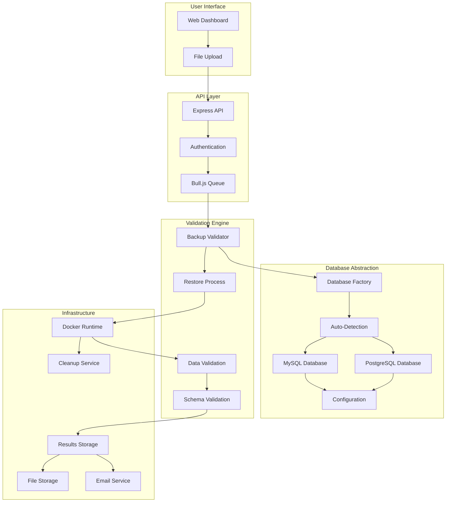
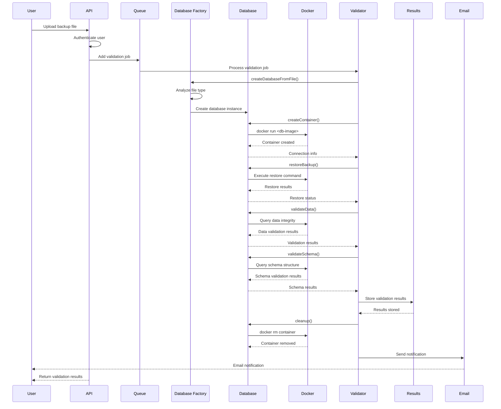
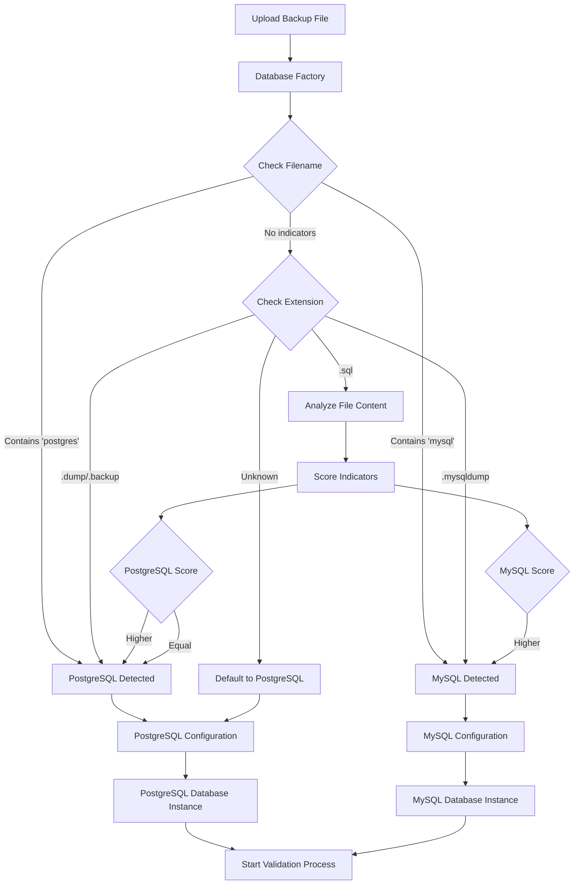
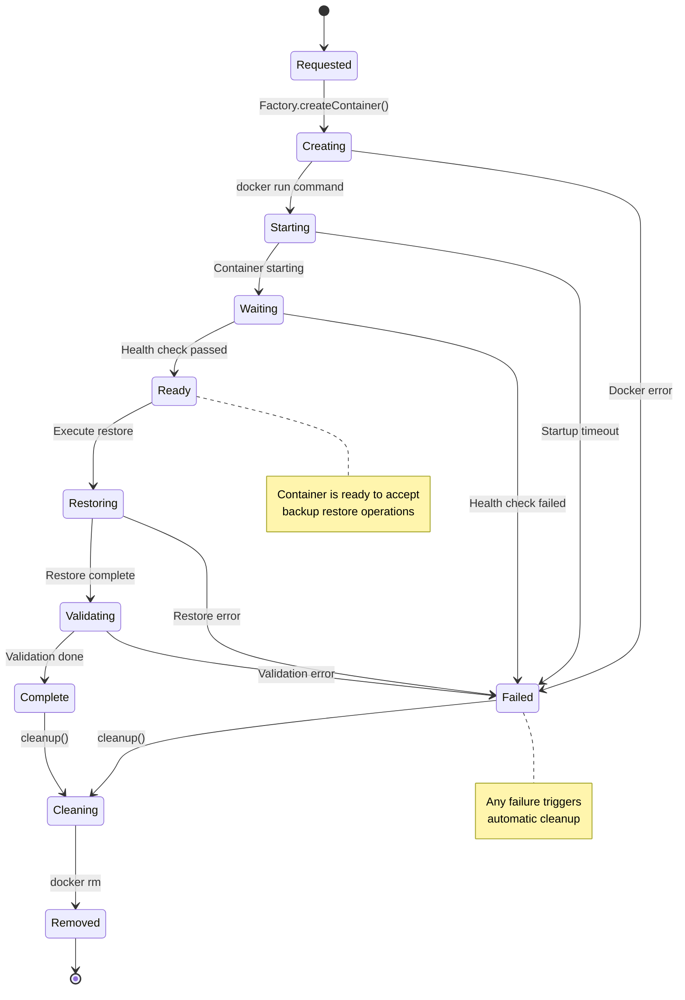
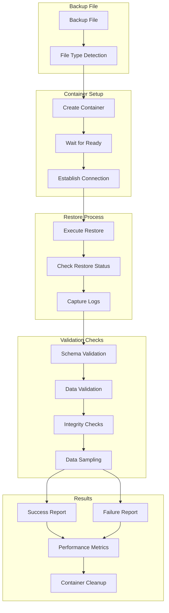
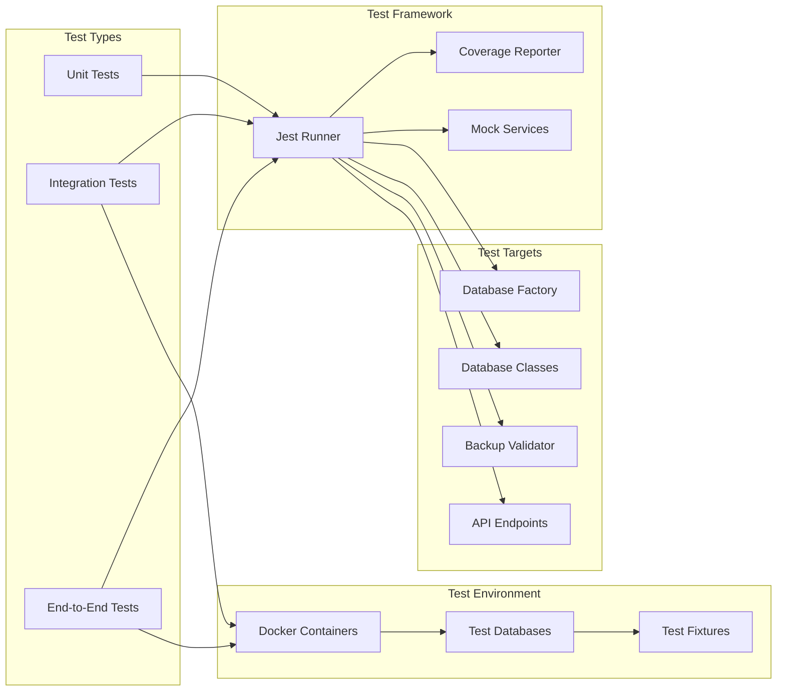
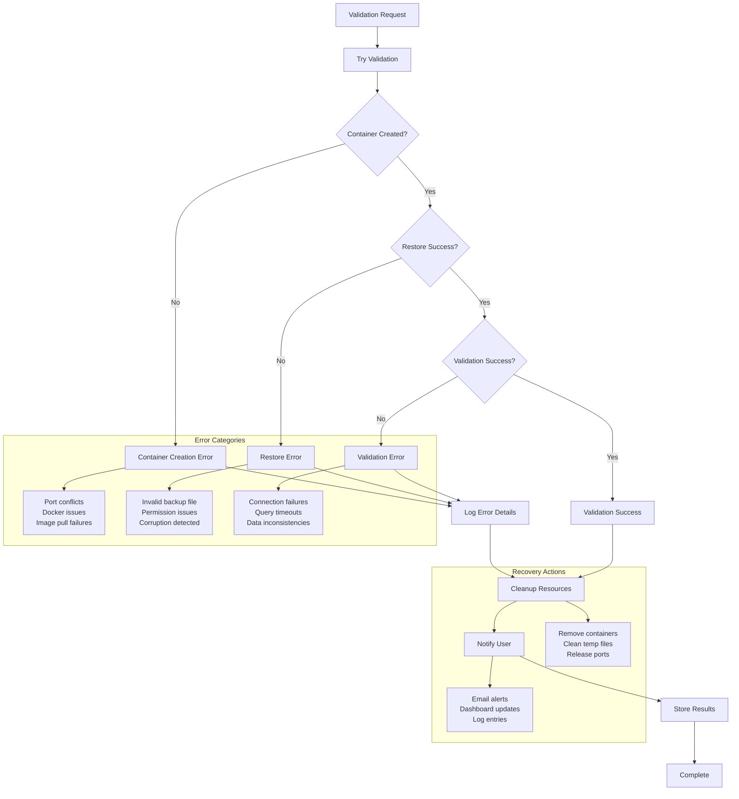
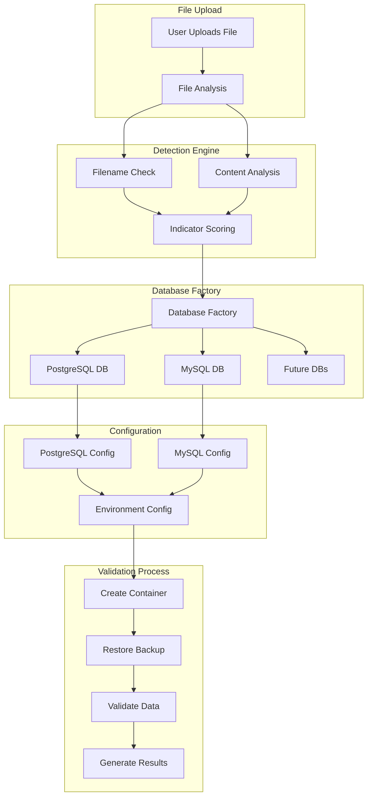
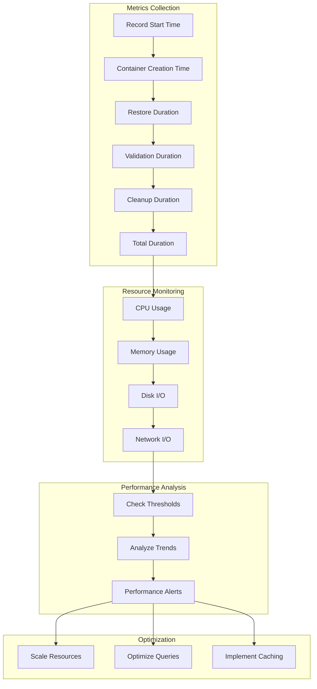
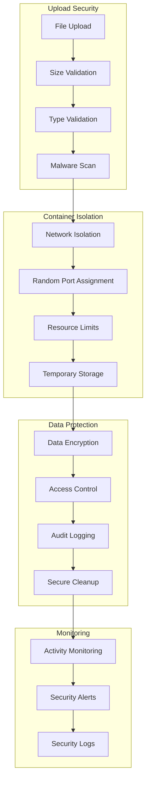

# BackupGuardian Data Flow Diagrams

## System Overview Flow

## Backup Validation Flow

## Database Auto-Detection Flow

## Container Lifecycle Management

## Data Validation Process

## Testing Framework Integration

## Error Handling Flow

## Multi-Database Support Flow

## Performance Monitoring Flow

## Security & Isolation Flow

These diagrams provide a comprehensive view of how data flows through BackupGuardian's new architecture, highlighting the database abstraction layer, testing framework integration, and multi-database support capabilities.
